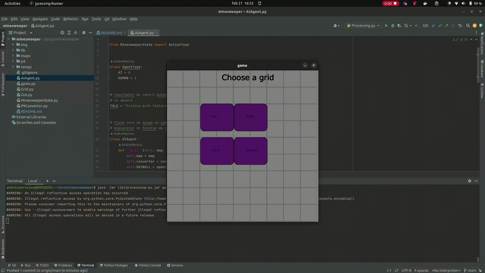

# Minesweeper - AI Solver

This is a bot written in Python, Processing and Mace4 that is capable of solving Minesweeper game board.
The bot uses logical deduction and constraint satisfaction techniques to determine the locations of mines on the board.

### Requirements 
To run the bot, you will need:
* Java 11
* Python 3
* Processing
* Mace4 theorem prover

### Usage 

1. Run: `java -jar lib/processing-py.jar game.py`
2. Select board configuration (9x9, 16x16, etc.)
3. Select Human or AI mode and the game will start

### Results
